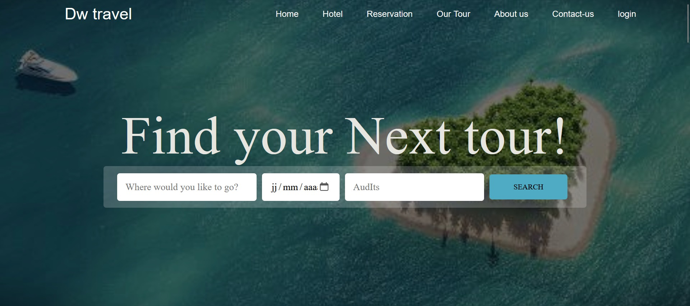
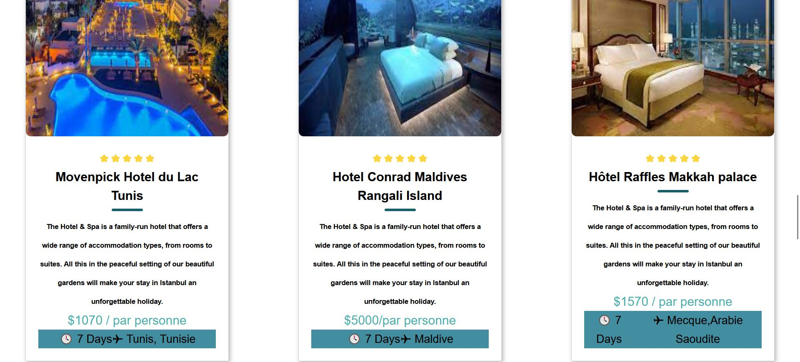
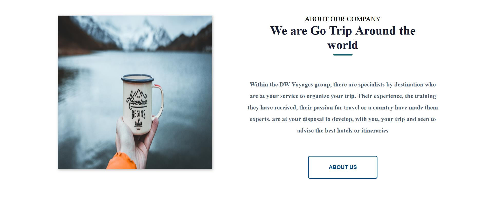
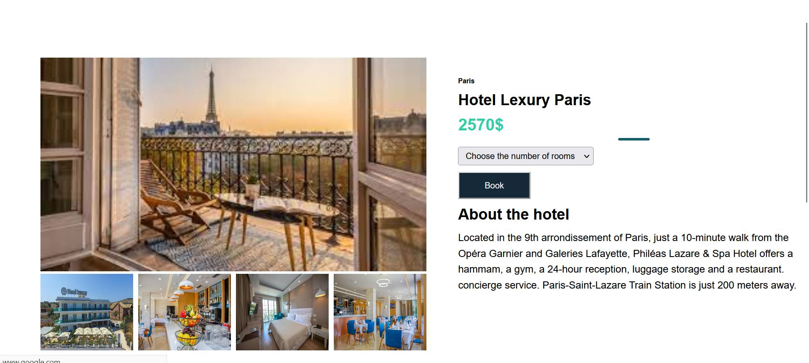

# Travel Tour

This project is a modern, responsive website designed for showcasing travel and tour packages. It features a clean and elegant design, leveraging the latest web technologies to provide a seamless user experience for browsing and booking tours.

## Technologies

The project is built using the following technologies:

- **HTML**: For structuring the content of the web pages.
- **CSS**: For styling and layout, including the use of CSS Grid and Flexbox for responsive design.
- **JavaScript**: For adding interactivity, such as navigation menu toggles, image sliders, and form validations.

## Project Demo

## Features

- **Responsive Layout**: Optimized for viewing on desktops, tablets, and smartphones.
- **Smooth Navigation**: Includes a fixed navigation bar with smooth scrolling.
- **Home Section**: Features a hero image, promotional text, and call-to-action buttons.
- **Tours Section**: Display of available tour packages with categories and filtering options.
- **Gallery Section**: Showcases beautiful images from various destinations.
- **Contact Section**: Contact form for users to get in touch, with additional contact details and map.
- **Footer**: Social media links, copyright information, and a back-to-top button.

